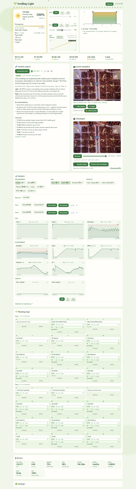

# Growlight

A self-contained seedling station for the Raspberry Pi: a sun-synced grow light,
a timelapse camera, per-tray canopy growth tracking, reservoir level sensing,
optional automatic watering, and a daily AI plant-health report, all driven from
a single Flask dashboard.

It runs on a Pi Zero 2 W controlling a cheap USB LED grow light through a MOSFET,
and grew from "dim a light on a schedule" into a small greenhouse controller.



*Light status and schedule, the latest snapshot with the cell grid, sensor charts,
the watering controls, and the daily AI plant-health report.*

---

## What it does

- **Sun-synced lighting.** Tracks local sunrise/sunset and drives the light with
  smooth fade-in/fade-out ramps via 1 kHz hardware PWM. Offsets, max brightness,
  and ramp length are all adjustable; a header graphic shows the current stage
  (moon at night drawn to the real lunar phase, sunrise, full sun, sunset).
- **Timelapse.** Captures a frame at a fixed interval during the photoperiod,
  holding the light at a constant brightness so every frame is exposed the same.
  Plays back in the browser frame-by-frame and renders an MP4 on-device.
- **Camera vision.** A canopy coverage index per tray (excess-green pixel share),
  logged and charted as a growth curve. Earlier versions measured per cell, but
  once seedlings spill over cell lines the per-cell attribution is fiction; tray
  boundaries are physical, so tray totals stay honest. Camera-based soil-dryness
  estimation was retired for the same reason: a closed canopy hides the soil.
- **Reservoir sensing.** Two non-contact level sensors on the outside of the
  source bucket give full / ok / empty. Empty hard-refuses every pump run so the
  pumps can never run dry, and fires a Discord alert until the bucket is refilled.
- **Watering.** A submersible pump with a float switch can fill the tray to a set
  level. Heavily guarded: per-dose, cooldown, and daily caps, one pump at a time,
  refusal on an empty reservoir, and a fill that caps out without the float
  tripping alerts and switches automatic watering off. Auto-watering is off by
  default and should stay off until the probes are calibrated.
- **Daily AI report.** Sends the latest photo plus the sensor data, per-variety
  germination stats, and the planting map to the Claude API and gets back a
  structured plant-health report: germination, growth stage, notable-cell notes,
  a variety check (flags a cell whose seedling looks inconsistent with what the
  map says was sown there; it never guesses species), light/water assessment,
  concerns, and recommendations.
- **Alerts.** Pushes report summaries (and anything else you wire up) to your
  phone via ntfy and/or a Discord channel.
- **Dashboard.** Live-editable settings, sensor charts, the timelapse player, and
  the report card. Read-only until you log in.

---

## Hardware

| Part | Detail |
| --- | --- |
| Computer | Raspberry Pi Zero 2 W (64-bit Raspberry Pi OS) |
| Light | 5 V USB LED grow light, ground switched low-side through an XY-MOS D4184 MOSFET |
| Camera | 8MP USB UVC webcam (120-degree lens) on a micro-USB OTG adapter. The Pi Camera Module was abandoned: the Zero's CSI ribbon connector was too unreliable |
| Pump | 5 V USB submersible pump through a second D4184 + 1N5819 flyback diode, on its own 5 V supply with a common ground |
| Float | Normally-open float switch in the destination tray |
| Reservoir level | 2x XKC-Y23A-**NPN** non-contact sensors strapped to the outside of the source bucket (low = minimum-safe height, high = near the rim). They sense through the wall; nothing touches the water. Buy the NPN version, not -V |
| Sensors | BME280 (air temp/RH/pressure, I2C 0x76), BH1750 (lux, 0x23), DS18B20 (soil temp, 1-Wire), 2x capacitive soil probes into an ADS1115 (0x48). All 3.3 V only |

### Pinout (BCM)

| Signal | GPIO | Physical pin | Notes |
| --- | --- | --- | --- |
| Light PWM | 18 | 12 | Hardware PWM, 1 kHz, to the light MOSFET gate |
| Pump tray 1 | 24 | 18 | To that pump's MOSFET gate (separate 5 V brick + common ground) |
| Pump tray 2 | 26 | 37 | Second pump MOSFET gate, same supply rules |
| Fan | 20 | 38 | Fan MOSFET gate; 5 V fan on the pump supply, flyback across the fan |
| Float tray 1 | 23 | 16 | Internal pull-up; other leg to GND (`FLOAT_ENABLED` in `sensors.py`) |
| Float tray 2 | 22 | 15 | Internal pull-up; other leg to GND |
| Reservoir high | 17 | 11 | XKC-Y23A OUT (near-rim sensor); internal pull-up |
| Reservoir low | 27 | 13 | XKC-Y23A OUT (minimum-safe-height sensor) |
| I2C SDA | 2 | 3 | Shared: ADS1115, BME280, BH1750 |
| I2C SCL | 3 | 5 | Same three devices |
| 1-Wire | 4 | 7 | DS18B20 soil temp (module has its own 4.7k pull-up) |

**GPIO25 (pin 22) is dead on the author's board.** Every assignment is
env-overridable precisely so a bad pin means one line in `.env`, not a code edit.

Pin overrides live in `.env` next to the app, written by `scripts/setup.sh` and
read by the systemd unit:

| Variable | Example | Notes |
| --- | --- | --- |
| `GROWLIGHT_LIGHT_PIN` | `18` | Hardware PWM: **only 18 or 19** |
| `GROWLIGHT_PUMP_PINS` | `1:24,2:26` | One entry per tray with a pump |
| `GROWLIGHT_FLOAT_PINS` | `1:23,2:22` | One entry per tray with a float |
| `GROWLIGHT_FAN_PIN` | `20` | Any free GPIO (software PWM) |
| `GROWLIGHT_RESERVOIR_PINS` | `low:27,high:17` | Reservoir level sensors; `none` if unwired |
| `GROWLIGHT_RESERVOIR_INVERT` | `1` | Set only if the bench test reads backwards (some units invert) |
| `ANTHROPIC_API_KEY` | | Enables the daily AI report |
| `DISCORD_WEBHOOK` | | Enables threshold alerts |

Answer `none` to any hardware prompt you do not have; that device is then never
claimed, its dashboard controls stay hidden, and re-running setup offers `none`
again rather than reverting to the suggested pin. Wire it up later and re-run
setup to enable it.

Edit `.env` and restart to apply; the journal prints the pins in use at startup.
`.env` is gitignored and written mode 600 because it holds secrets.

The ADS1115 runs off 3.3 V (pin 1) and GND (pin 9), with ADDR to GND for
address 0x48. Two capacitive soil probes go on A0 (tray 1) and A1 (tray 2),
powered from the same 3.3 V rail so their output can't exceed the ADC supply.
Enable I2C with `raspi-config` (or `dtparam=i2c_arm=on`) and confirm the board
shows up: `i2cdetect -y 1` should list `48`.

Enable hardware PWM on GPIO18 by adding to `/boot/firmware/config.txt`:

```
dtoverlay=pwm,pin=18,func=2
```

**Float fail-safe.** Mount the float so that rising water *opens* the switch. Open
(reads "full") means stop, which is also the broken-wire state, so a disconnected
float fails safe by refusing to pump.

**Pump siphoning.** A float only cuts the pump; it can't stop a siphon. Either keep
the discharge above the water line or drill a ~1.5 mm vent hole at the top of the
tubing run.

Wiring diagrams are in `growlight_wiring.svg`, `pump_float_wiring.svg`, and
`sensor_wiring.svg`.

---

## Install

On the Pi:

```bash
git clone <your-repo-url> ~/growlight
cd ~/growlight
bash scripts/setup.sh
```

It asks which GPIO each device is on (suggesting the defaults below) and
optionally takes your Anthropic API key and Discord webhook. Answers go to
`.env`, which the systemd unit reads, so nothing in the Python needs editing.
Re-running offers your previous answers as the defaults; `bash scripts/setup.sh
--defaults` skips every prompt.

The script is idempotent and preserves `config.json` and `growlight.db`, so it is
safe to re-run after an update. It handles:

1. System packages (`rpicam-apps`, `ffmpeg`, `i2c-tools`)
2. Boot config: the PWM overlay for light dimming, plus I2C and 1-Wire for the
   sensors. **Adding any of these requires a reboot**, and the script says so.
3. Swap, so a timelapse render does not OOM a 512 MB board
4. A venv with the core and sensor libraries
5. The systemd unit, enabled at boot
6. Shell convenience (venv auto-activate)
7. A hardware check: which I2C addresses and DS18B20 sensors are actually visible

That last step is the useful one when something is not reading. It distinguishes
"the sensor is not wired" from "the software is not seeing it": if `i2cdetect`
does not list the address, no amount of restarting the service will help.

After the first run, reboot if asked, then set the location and schedule in
Settings on the dashboard.

### Run as a service

`scripts/setup.sh` writes and enables `/etc/systemd/system/growlight.service`
for you. Useful commands:

```bash
sudo systemctl status growlight
sudo systemctl restart growlight
journalctl -u growlight -f
```

### Deploy updates

```bash
cd ~/growlight && git pull && sudo systemctl restart growlight
```

Static assets are versioned by file mtime, so the browser picks up new JS and CSS
on its own; no hard refresh needed.

If a pull leaves one file behind, the service can end up running a mix of old and
new code. `git status` should be clean before a pull, and the journal is the
place to confirm the restart came up without a traceback.

---

## Configuration

Settings live in `config.json` (created on first run, gitignored). Most are
editable from the dashboard Settings panel; the rest are edited in the file.

| Key | Default | Meaning |
| --- | --- | --- |
| `latitude` / `longitude` / `timezone` | Thousand Oaks, CA | Location for sun times |
| `max_bright` | 100 | Peak brightness (%) |
| `ramp_min` | 30 | Fade-in/out length (minutes) |
| `sunrise_offset_min` / `sunset_offset_min` | 0 | Shift the on/off times |
| `capture_enabled` | false | Timelapse on/off |
| `capture_interval_min` | 30 | Minutes between frames |
| `capture_brightness` | 100 | Brightness held during each photo |
| `roi` | "" | Crop as `x,y,w,h` fractions, blank = full frame |
| `cam_width` / `cam_height` | 2304 / 1296 | Capture resolution at full field of view. The Module 3 sensor is 4608x2592, but a full 12MP capture runs the Pi Zero 2 W out of memory, so the default is the 2304x1296 binned mode (same view, ~3MP). Keep the sensor's 16:9 aspect or the frame gets cropped. Raise to 4608x2592 only on a Pi with more RAM |
| `sample_interval_min` | 5 | Sensor logging interval |
| `auto_water` | false | Master switch for automatic watering (keep off until calibrated) |
| `pump_max_seconds` | 20 | Cap on a single dose |
| `pump_cooldown_min` | 30 | Minimum wait between auto doses |
| `pump_daily_max_seconds` | 180 | Daily runaway backstop |
| `fill_max_seconds` | 60 | Cap on a fill-to-float run if the float never trips |
| `ntfy_topic` | "" | Set to enable ntfy push |
| `discord_webhook` | "" | Set to enable Discord alerts |
| `ai_enabled` | false | Daily AI report on/off |
| `ai_model` | `claude-opus-4-8` | Claude model for the report |
| `ai_report_hour` / `ai_report_minute` | 8:00 | When the daily report runs |
| `ai_notify` | true | Push the report summary |
| `ai_notes` | (grow description) | Context handed to the AI; list what you planted here to sharpen species guesses |
| `alert_dli_low` | 4 | Daily light integral floor (mol/m2/day), judged just after lights-off; 0 disables |
| `probe_cal` | {} | Per-tray ADC wet/dry anchors for the soil probes, set from the dashboard. A live reading outside its anchors shows a red "recal" badge: the percentage is pegged and the dry alert is blind until the anchor is recaptured |
| `probe_names` | Tray 1 / Tray 2 | Labels for the two probes (A0 = tray 1, A1 = tray 2) |

### Secrets (all gitignored)

| File | Purpose |
| --- | --- |
| `.secret` | Flask session key (auto-generated) |
| `.anthropic_key` | Claude API key for the AI report (or set `ANTHROPIC_API_KEY`) |
| `.discord_webhook` | Discord webhook URL (or put it in `config.json`) |

```bash
echo 'sk-ant-...'                              > ~/growlight/.anthropic_key
echo 'https://discord.com/api/webhooks/...'    > ~/growlight/.discord_webhook
chmod 600 ~/growlight/.anthropic_key ~/growlight/.discord_webhook
```

---

## Features in detail

### Authentication

With `password_hash` blank the dashboard is fully open. Set a password to make it
read-only until login (viewing stays open; editing, rendering, watering, and
settings require a session):

```bash
./venv/bin/python scripts/set_password.py
```

Behind HTTPS keep `cookie_secure: true`; for plain-http local testing set it
false.

### USB (UVC) camera

Set **Camera type** to "USB webcam" in Settings. The capture path uses
`v4l2-ctl` rather than `rpicam-still`, and pins exposure, gain, focus and white
balance so every frame is taken under identical conditions; auto white balance
in particular drifts badly under magenta grow light and ruins both the video and
the per-cell colour analysis.

Two details worth knowing:

* Controls are applied in two passes. A manual control stays flagged `inactive`
  and rejects writes until its automatic counterpart is switched off, so
  `focus_automatic_continuous=0` must land before `focus_absolute` can be set.
* Don't guess the focus value: the **Focus sweep** button walks `focus_absolute`
  coarse then fine, scores each stop by Laplacian sharpness on a live capture,
  and pins the sharpest (~90 s; the timelapse pauses). The Align preview also
  shows a live sharpness number for manual tweaking.
* Each capture grabs a short burst and keeps the last frame. The first frame
  after opening a UVC device is routinely dark or torn.

Find your camera and its supported sizes with:

```bash
v4l2-ctl --list-devices
v4l2-ctl -d /dev/video0 --list-formats-ext
v4l2-ctl -d /dev/video0 --list-ctrls
```

### Canopy tracking

`growth.py` runs as a subprocess against each scheduled frame and logs canopy
coverage per tray (`canopy:1`, `canopy:2`): the share of plant pixels in that
tray's region, via the excess-green index (2G - R - B), which survives the
magenta grow light where hue-based detection fails. It is a relative tracker,
understated under coloured light; treat it as a growth curve, not absolute
coverage.

Per-cell measurement and camera-based soil-dryness estimation existed in earlier
versions and were retired: seedlings spill across cell lines (making per-cell
numbers fiction) and a closed canopy hides the soil. Soil moisture comes from
the probes.

Define the grid by dragging its corners on the photo (or the Detect button),
then lock it. Manual captures are tagged `_m` in the filename; they are analyzed
only inside the photoperiod, and the daily AI report always prefers the latest
scheduled frame so an off-schedule dark shot never becomes its input.

### Watering

`run_pump(seconds)` does a timed dose; `run_pump_until_full()` fills until the
float trips, debounced against slosh, with `fill_max_seconds` as a backstop.
Both honour the per-dose, cooldown, and daily caps, run one pump at a time,
refuse outright when the reservoir reads empty, and always force the pump off in
a `finally`. A fill that hits the cap without the float tripping raises a
Discord alert and switches `auto_water` off. Keep `auto_water` off until the
probes are calibrated and the seedlings are established; overwatering
(damping-off) is the number-one seedling killer.

### Reservoir level

The two XKC-Y23A sensors combine into one state: **full** (water at both),
**ok** (low only), **empty** (neither; pump runs refused), and **fault** (high
wet but low dry, which is physically impossible: a sensor died, slipped off the
wall, or needs its sensitivity pot adjusted). Empty and fault each alert with
recovery notices. Mount the flat faces tight against the bucket wall; rated
through ~13 mm of non-metal. If the bench test reads backwards, set
`GROWLIGHT_RESERVOIR_INVERT=1` instead of rewiring.

### Daily AI report

When enabled, the controller sends the latest photo (downscaled) plus the current
data to the Claude API once a day at the configured time, and shows the result on
the dashboard while pushing the summary to ntfy/Discord. A restart does **not**
regenerate the report; it keeps the last one. New reports come only from crossing
the scheduled time or pressing "Generate now". Cost is roughly a cent or two per
report.

### Alerts

`notify.py` (ntfy) and `discord_alert.py` (Discord webhook) are independent
transports; either fires if configured. Test them:

```bash
./venv/bin/python notify.py "test"
./venv/bin/python discord_alert.py "test"
```

---

## Reverse proxy

A separate box runs nginx and proxies the dashboard to the public site over HTTPS:

```nginx
location / {
    proxy_pass http://grow:5000;
    proxy_set_header X-Forwarded-Proto $scheme;
}
```

---

## API

Read endpoints are open; mutating ones require a session when a password is set.

| Method | Path | Purpose |
| --- | --- | --- |
| GET | `/api/status` | Full state: light, sensors, water, settings, auth |
| GET | `/api/series` | Sensor history for charts |
| GET | `/api/photos`, `/photo/latest`, `/thumb/<name>` | Timelapse frames |
| GET | `/video` | Rendered MP4 |
| GET | `/api/float` | Fast float read |
| GET | `/api/report` | Latest AI report + generating flag |
| GET | `/api/series_all` | Every sensor's history in one call (feeds the chart grid) |
| GET | `/api/frame_context?ts=` | Sensor readings nearest a timelapse frame (feeds the scrubber overlay) |
| POST | `/api/settings` | Update settings. Accepts partial bodies; valid fields are saved and invalid ones come back by name in `errors`, so one bad field never silently discards the rest |
| POST | `/api/grid`, `/api/detect_grid` | Cell grid |
| POST | `/api/focus_sweep` | Run (or cancel) the USB camera focus sweep |
| POST | `/api/probe_cal` | Capture a tray probe's wet/dry anchor |
| POST | `/api/purge_series` | Delete a sensor prefix's logged history (explicit, destructive) |
| POST | `/api/probe_tempcomp` | Estimate/apply a probe's temperature-drift coefficient |
| POST | `/api/fan` | Fan mode: `auto`, `on`, or `off` |
| POST | `/api/schedule` | Adjust the light window (used by the chart drag handles) |
| POST | `/api/light` | Manual light hold (auto/on/off) + manual brightness |
| POST | `/api/tray_layout` | Add, remove, rename or resize a tray (confirm required if cells would be lost) |
| POST | `/api/reset_timelapse` | Archive the current run and start fresh (confirm required) |
| POST | `/api/rebuild_thumbs` | Regenerate thumbnails after the corners move |
| POST | `/api/trays` | Save the planting map (what's sown in each cell) |
| POST | `/api/render` | Render the timelapse MP4 |
| POST | `/api/capture` | Take a photo now (tagged manual) |
| POST | `/api/pump` | Timed dose or fill-to-float, per tray (`tray: "1"` or `"2"`) |
| POST | `/api/ai_settings`, `/api/report` | AI report config / generate now |
| POST | `/api/login`, `/api/logout` | Auth |

Secrets (`password_hash`, webhook URLs, ntfy topic) are redacted from
`/api/status`; the read-only dashboard never exposes them.

### Schedule modes

| Mode | Behaviour |
| --- | --- |
| `solar` | Follows local sunrise/sunset with offsets (tracks the season) |
| `fixed` | The same clock times daily; an off time before the on time runs overnight |
| `duration` | A constant day length anchored to the off time: lights-off stays put, lights-on moves |

Set it under Settings > Schedule. In `fixed` and `duration` modes the day-curve
chart gets draggable handles on the lights-on and lights-off edges (logged-in
only): drag to adjust, snapped to five minutes. In `fixed` mode each edge sets
its own clock time; in `duration` mode the right edge moves the anchor and the
left edge changes the day length. Dragging commits via `POST /api/schedule`. Sunrise and sunset are still computed and shown
on the dashboard in every mode. Ramps apply the same way in all three.

### Discord alerts

Set `discord_webhook` in the secrets file (same place as the API key), then
enable **Threshold alerts** in Settings. Rules cover soil temperature (high and
low), tray dryness on calibrated probes, humidity, daily light integral that
finishes under the floor (judged once, just after lights-off), reservoir empty,
reservoir sensor fault, watering that fails to reach the float, camera failures,
and sensors that stop reporting (a sensor silent three days is treated as
removed and stops reminding).

Each rule fires once when a condition has held for the sustain window, reminds
on the cooldown interval while it persists, and posts a recovery notice when it
clears. Hysteresis and the sustain window mean a sensor hovering at a threshold
cannot spam the channel. Alert state is in memory, so a restart re-arms
everything.

---

## Project layout

```
growlight.py        main app: light/capture/sample/watering/report loops + Flask
db.py               SQLite logging (WAL) with downsampling
sensors.py          sensor I/O: probes, floats, reservoir, air, lux, soil temp
alerts.py           threshold alert state machine (sustain, hysteresis, reminders)
growth.py           per-tray canopy vision (subprocess)
detect_corners.py   grid corner auto-detect (subprocess)
hoststats.py        Pi health: CPU temp, load, memory, throttling, wifi
notify.py           ntfy push transport
discord_alert.py    Discord webhook transport
ai_report.py        Claude API daily report
templates/index.html, static/{app.js,style.css}
scripts/{setup.sh,set_password.sh,test_ramp.py}
```

Runtime files (`config.json`, `growlight.db`, `timelapse/`, `.secret`,
`.anthropic_key`, `.discord_webhook`, `ai_report.json`) are gitignored.

---

## Troubleshooting

- **Timelapse MP4 plays but is black.** A pixel-format/colour issue, not a corrupt
  file. The render forces limited-range `yuv420p`, a mod-16 height, and explicit
  BT.601 colour tags precisely so hardware decoders (VLC's especially) don't draw
  black. If an old file is black, just re-render. To check a file:
  `ffprobe -v error -select_streams v:0 -show_entries stream=pix_fmt,color_range,color_space ...`.
- **Discord returns HTTP 403.** Discord's Cloudflare blocks the default
  `Python-urllib` user agent; `discord_alert.py` sends a real `User-Agent`, which
  fixes it.
- **`lgpio` won't pip-install.** Use the apt package `python3-lgpio` and enable
  system site packages in the venv (see Install).
- **A new AI report fires on every reboot.** The Pi Zero 2 W has no RTC, so at
  boot the clock is wrong until NTP corrects it. The report scheduler waits for
  the clock to sync (via `/run/systemd/timesync/synchronized`) before deciding
  anything, so it won't mistake the post-NTP time jump for the scheduled time. If
  you don't use systemd-timesyncd, add `After=time-sync.target` to the service
  unit and enable `systemd-time-wait-sync` so the service starts only once the
  clock is set.
- **Pump does nothing.** Check the separate 5 V supply and common ground, and that
  `gpiozero` loaded (the log prints if the GPIO backend is unavailable).
- **Photo looks zoomed in / cropped after a camera swap.** The capture resolution
  must match the sensor's native aspect ratio, or libcamera crops into the middle
  of the sensor. Set `cam_width`/`cam_height` to a 16:9 size for Module 3 (default
  2304x1296) or 2592x1944 for Module 1. After changing the frame, re-do the cell
  grid, since the old corners no longer line up.
- **"Capture failed" while the live preview works.** The preview runs at a lower
  resolution than a full capture. If Take photo fails but Align previews fine, the
  capture resolution is too large for available memory, which happens on the Pi
  Zero 2 W (512MB) at the sensor's full 4608x2592. Lower `cam_width`/`cam_height`
  to 2304x1296; the preview proves that size works on the hardware.
